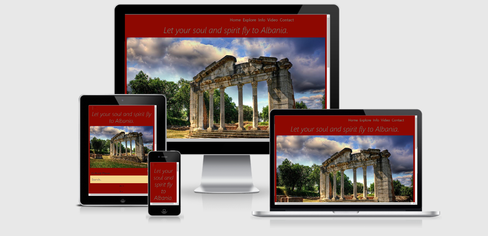

If you love travelling this is the country that would be worth to visit.
## Albania

# Contents:
* UX 👍
* Project Goals
* Target Audience Goals
* Site Owner Goals
* User Stories
* User Requirements and Expectations
* Design Choices 
* Icons
* Colours
* Styling
* Images
* Backgrounds
* Planning✏️
* Wireframes 🔧
* Website Layout
# Features 🎡
* Features that have been developed
* Technologies Used 👨‍💻
* Planning + Testing: ✏️ 🔌
* Bugs 🐞
* Deployment 🚀
## Languages:

[HTML](https://en.wikipedia.org/wiki/HTML5)

[CSS](https://www.w3.org/Style/CSS/Overview.en.html)

[Javascript](https://en.wikipedia.org/wiki/JavaScript)

## Tools & Libraries

* [Git](https://git-scm.com/)
* [Bootstrap](https://maps.google.com/)
* [Jquery](https://jquery.com/)
* [Font-Awesome](https://fontawesome.com/)
* [TinyPng](https://tinypng.com/) __(image compression)__
* [Am-I-Responsive] (http://ami.responsivedesign.is/)
* [W3-Official-Validator] (https://validator.w3.org/)
  
  # Deployment:   

Albania was developed on GitPod, using  GitHub to host the repository.

When deploying Albania the following steps were made:

 * Opened up GitHub in the browser.
 * Signed in using username and password.
 * Selected my repositories.
 *  Navigated to 'https://xhulja14.github.io/Albania/'.
 * In the top navigation clicked 'settings'.
 * Scrolled down to the GitHub Pages area.
 * Selected 'Master Branch' from the 'Source' dropdown menu.
 * Clicked to confirm my selection.
 * Albania is now live on GitHub Pages.

<!--Strong-->

 __Enjoy coding!__
